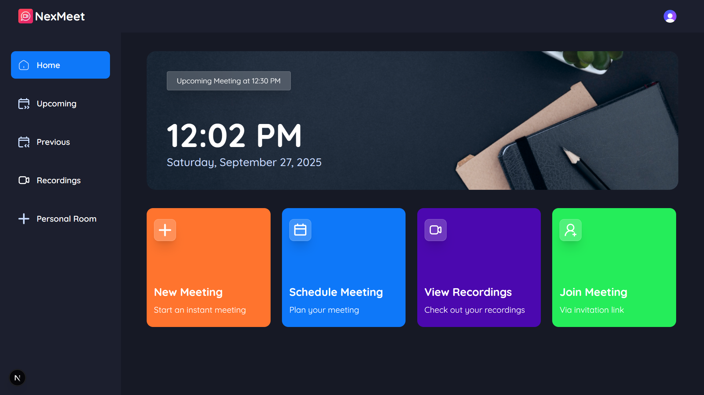

# 🎥 Nexmeet - A Video Conferencing App

A modern **video conferencing platform** built with Next.js 15.

---

## 🚀 Tech Stack

- **TypeScript** – Strongly typed, scalable codebase
- **Next.js 15** – App Router, SSR, and API routes for modern React apps
- **Tailwind CSS v4** – Utility-first styling with responsive design
- **shadcn/ui** – Prebuilt accessible components for consistent UI
- **Clerk** – Authentication & user management (social sign-on, email, password)
- **GetStream.io** – Real-time video conferencing & collaboration APIs

---

## 🔋 Features

✅ **Authentication** – Secure login/signup via Clerk (social or email), fine-grained access control
✅ **New Meeting** – Start meetings instantly with camera/mic pre-configuration
✅ **Meeting Controls** – Recording, emoji reactions, screen share, mute/unmute, sound, grid layouts, participant management (pin, mute, block, allow video)
✅ **Exit Meeting** – Leave individually or end the meeting for all (if host)
✅ **Schedule Future Meetings** – Set date & time; manage them via an _Upcoming Meetings_ page
✅ **Past Meetings** – Browse previous sessions with metadata
✅ **Recorded Meetings** – Rewatch saved sessions anytime
✅ **Personal Room** – Unique permanent meeting link per user
✅ **Join via Link** – Quick access to meetings shared by others
✅ **Real-time Security** – Fully secure, low-latency interactions
✅ **Responsive Design** – Mobile, tablet, and desktop optimized
✅ **Reusable Code Architecture** – Modular and scalable component structure

---

## 📸 Screenshots (Optional)

